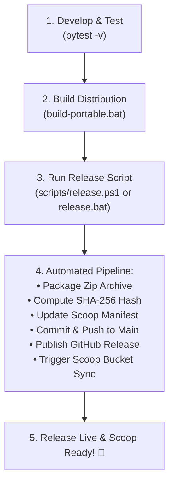

# Release Engineering & Maintainer Guide

This guide explains the release workflow for ProcessSentinel, semantic versioning guidelines, and how the automated release pipeline operates.

---

## 🎯 Release Workflow Overview

Publishing a new release of ProcessSentinel is fully automated through `scripts/release.ps1` (or `release.bat`). Maintainers only need to write features, verify tests, build the portable distribution, and then run the release script.



---

## 📋 Pre-Release Checklist

Before triggering a release, complete these verification steps:

1. **Verify Unit Tests**:
   ```powershell
   .\.venv\Scripts\pytest.exe -v
   ```
   *Ensure all 18+ tests pass.*

2. **Update In-App Version (Optional)**:
   If updating the title bar version, update the version string in `src/gui/app.py`.

3. **Build the Portable Binary**:
   ```powershell
   .\build-portable.bat
   ```
   *Verify that `dist\ProcessSentinel\ProcessSentinel.exe` exists.*

---

## 🚀 Publishing a Release

### Method 1: Interactive (Recommended for Humans)

Double-click **`release.bat`** (or execute `.\release.bat` from terminal).

The script will prompt you for:
* **Release Version**: Enter the version number without a `v` (e.g. `2.1.0`).
* **Confirmation**: Displays a summary of the release plan and asks for confirmation before touching GitHub.

---

### Method 2: Non-Interactive / Scripted

You can also pass all parameters directly to `scripts/release.ps1`:

```powershell
powershell -ExecutionPolicy Bypass -File .\scripts\release.ps1 `
  -Version "2.1.0" `
  -Title "ProcessSentinel v2.1.0 - Performance & Alert Improvements" `
  -Notes "### What's Changed in v2.1.0`n* Feature 1`n* Feature 2" `
  -Force
```

---

## ⚙️ What the Automated Pipeline Does

`scripts/release.ps1` handles the following operations in sequence:

1. **Pre-flight Checks**:
   * Ensures `dist\ProcessSentinel\ProcessSentinel.exe` is compiled and present.
   * Verifies `gh` (GitHub CLI) is authenticated.
   * Checks that the target version tag (`vX.Y.Z`) does not already exist.

2. **Packaging**:
   * Compresses `dist\ProcessSentinel\*` into `ProcessSentinel-vX.Y.Z-windows-x64.zip`.

3. **Checksum Generation**:
   * Computes the exact SHA-256 hash of the zip file.

4. **Scoop Manifest Update**:
   * Updates `processsentinel.json` at the repository root with the new version, download URL, and SHA-256 hash.
   * Strictly enforces **CRLF line endings** and **UTF-8 without BOM** to comply with Scoop CI standards.

5. **Git Synchronization**:
   * Stages, commits, and pushes the updated manifest to `origin/main`.

6. **GitHub Release Publication**:
   * Calls `gh release create` to create the git tag `vX.Y.Z`, upload the portable zip asset, and publish release notes.

7. **Scoop Bucket Synchronization**:
   * Dispatches the `sync-processsentinel.yml` workflow in `zunaidFarouque/Zunaid-Scoop-Bucket` via the GitHub API.
   * Cleans up the temporary local zip archive.

---

## 🔄 How Users Update

Once the release is published and the bucket sync finishes:

```powershell
# Users update to the new version with a single command:
scoop update processsentinel
```

Scoop downloads the new binary, updates the shims and shortcuts, and **automatically preserves the user's `config.json`** via Scoop's persistence system.
